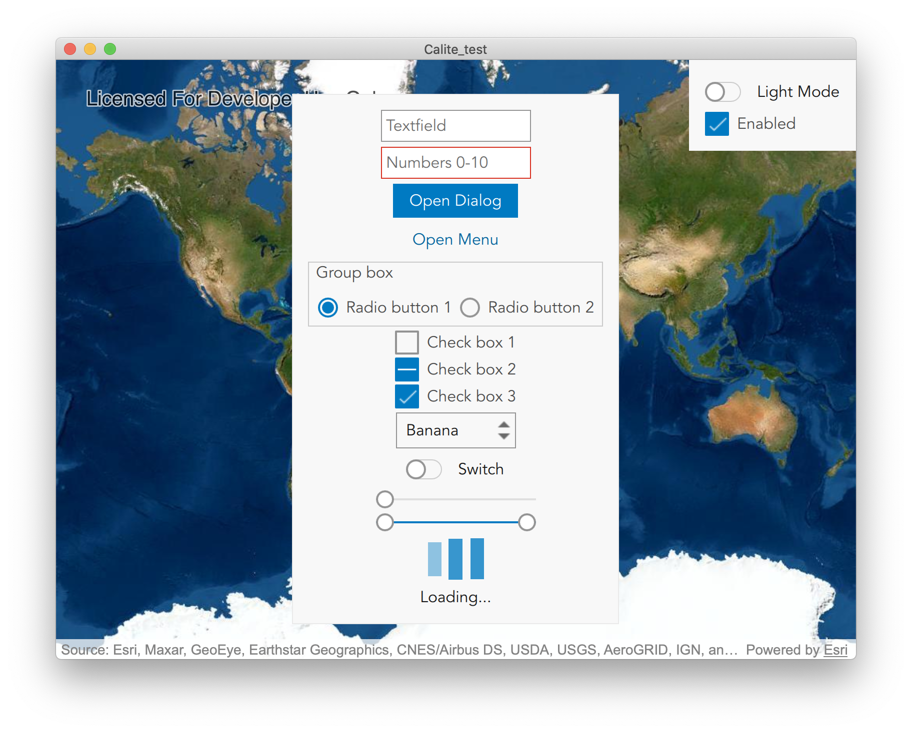
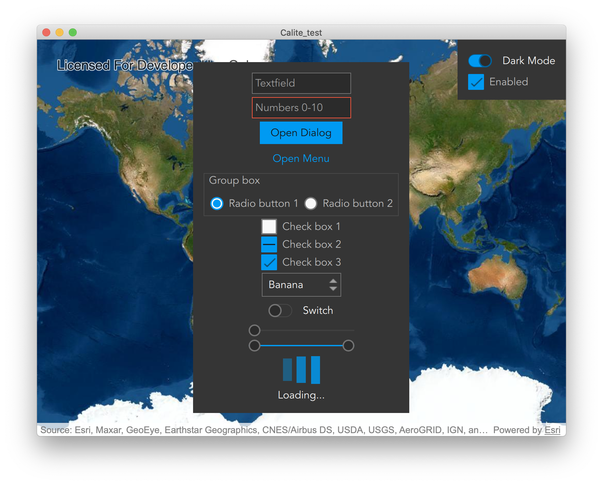

# Esri Calcite Style

Esri’s design system ([Calcite](https://esri.github.io/calcite-web/)) enables you to create beautiful, easy to use, and consistent experiences across apps with minimal effort.

This is a WIP module which contains a port of Esri's Calcite Web Style that is QML compatible.

## Light Mode



## Dark Mode



## Integration

To integrate Calcite into your app, add the following lines to your `*.pro` file:

```pro
QT += quickcontrols2
RESOURCES += path/to/arcgis-runtime-toolkit-qt/calcite-qml/Calcite/calcite.qrc
```

And then in `main.cpp` add the following lines:

```cpp
#include <QQuickStyle>
...
QQuickStyle::addStylePath("qrc:///esri.com/imports/");
```

Then, the most flexible way to use the style is to create a [`qtquickcontrols2.conf`](https://doc.qt.io/qt-5/qtquickcontrols2-configuration.html) file
with the following properties:

```ini
[Controls]
FallbackStyle=Material
Style=Calcite

[Calcite]
Font\Family=Avenir
Font\PixelSize=16
Font\Weight=50
```

### Typefaces

Calcite Web primarily uses Avenir Next. For best results your app should use Avenir Next, or a font similar to Avenir Next, such as Avenir or Montserrat.

#### Licensing

If you are a developer outside Esri, it is your responsibility to ensure you are complaint with
the font license agreement of any font you use.

For further details see [Calcite Web TypeFaces](https://esri.github.io/calcite-web/documentation/type/).

## Available tools

  - [x] ApplicationWindow
  - [x] BusyIndicator
  - [x] Button
  - [x] Checkbox
  - [x] CheckDelegate
  - [x] ComboBox
  - [ ] DelayButton
  - [ ] Dial
  - [x] Dialog
  - [x] DialogButtonBox
  - [x] Drawer
  - [x] Frame
  - [x] GroupBox
  - [x] ItemDelegate
  - [x] Label
  - [x] Menu
  - [x] MenuBar
  - [x] MenuBarItem
  - [x] MenuSeparator
  - [x] Page
  - [x] PageIndicator
  - [x] Pane
  - [x] Popup
  - [ ] ProgressBar
  - [x] RadioButton
  - [x] RadioDelegate
  - [x] RangeSlider
  - [x] RoundButton
  - [ ] Scrollbar
  - [ ] ScrollIndicator
  - [x] Slider
  - [ ] Spinbox
  - [ ] SplitHandle
  - [x] Switch
  - [ ] SwitchDelegate
  - [ ] TabBar
  - [ ] TabButton
  - [ ] TextArea
  - [x] TextField
  - [ ] ToolBar
  - [ ] ToolButton
  - [ ] ToolSeparator
  - [ ] Tooltip
  - [ ] Tumbler
