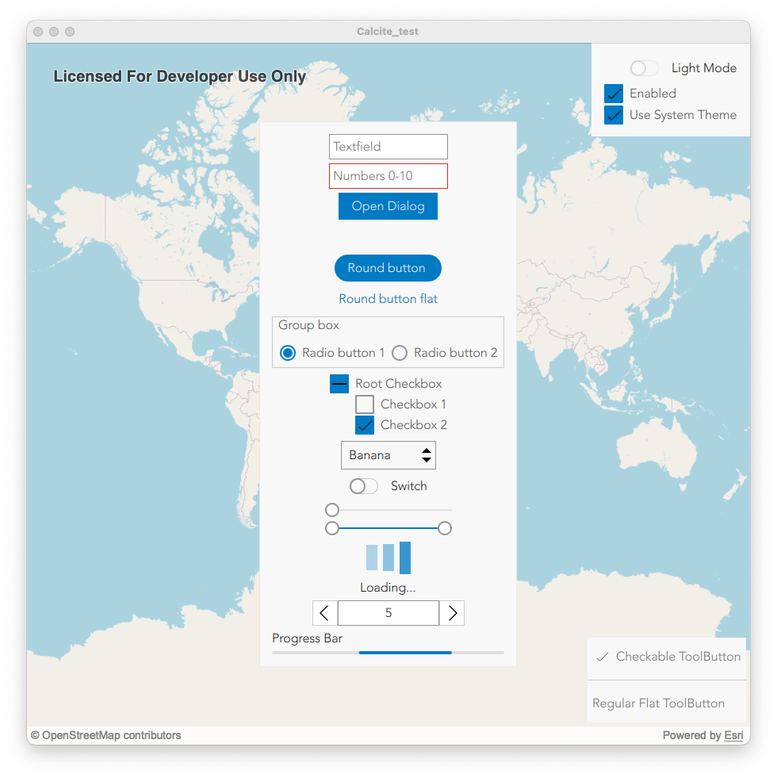
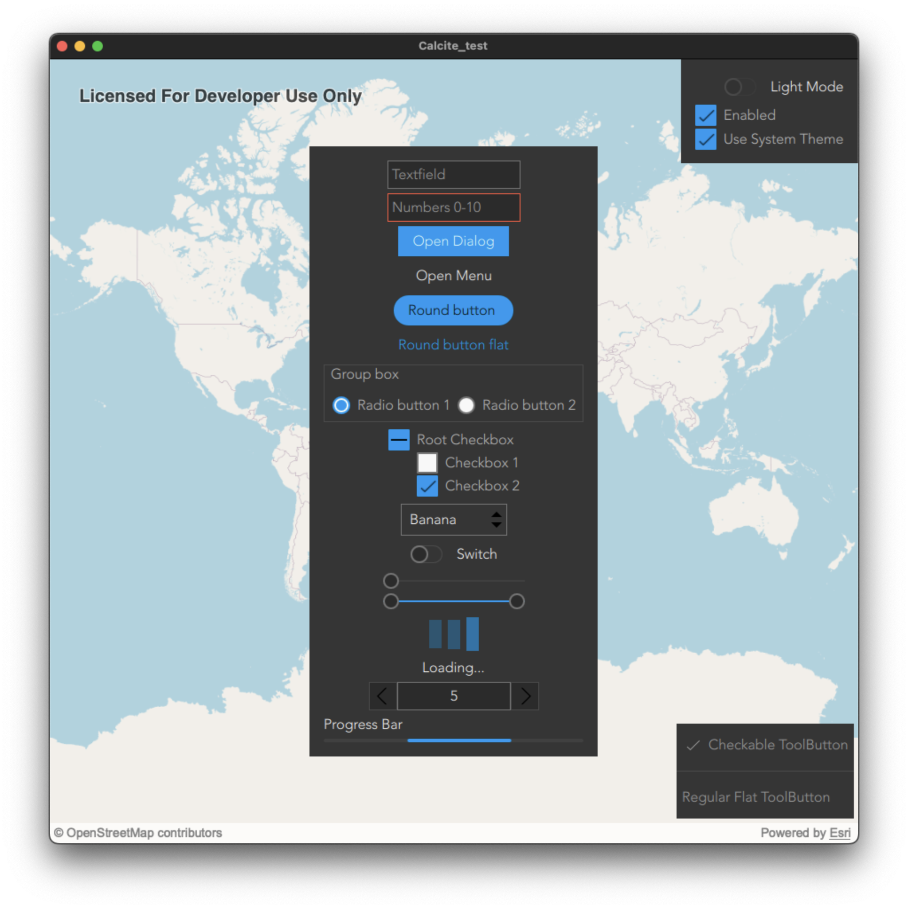

[](https://developers.arcgis.com/qt/latest/toolkit/api-reference/) [](https://developers.arcgis.com/qt/) [](https://github.com/Esri/arcgis-maps-sdk-toolkit-qt)

# Esri Calcite Style

Esri’s design system ([Calcite](https://esri.github.io/calcite-web/)) enables you to create beautiful, easy to use, and consistent experiences across apps with minimal effort.

Calcite provides visual styles that are applied to your UI controls in your app. These styles are QML compatible and are configured by adding them to your .qml files. The styles include options for creating Light and Dark themed UI's. There are over 30 styles available that can be used on Qt controls like: Button, CheckBox, Menu, RadioButton, ToolBar, and so forth. 

Other styling options (like: Basic, Fusion, macOS, Material, Windows...) are available for your QML based UI controls and are provided by the Qt Group. You can learn more about these styles in the [Styling Qt Quick Controls](https://doc.qt.io/qt-6/qtquickcontrols-styles.html) documentation. 

## Light Mode



## Dark Mode



## Integration

Add Calcite to your `*.pro` file:
```pro
QT += quickcontrols2
RESOURCES += path/to/arcgis-maps-sdk-toolkit-qt/calcite/Calcite/calcite.qrc
QML_IMPORT_PATH += path/to/arcgis-maps-sdk-toolkit-qt/calcite/
```

### Method 1: Direct Import

Import Calcite directly in your QML files:
```qml
import QtQuick
import QtQuick.Controls
import Calcite 1.0

ApplicationWindow {
    Button { text: "Calcite Button" }
    Rectangle { color: Calcite.brand }
}
```

### Method 2: Configuration File

Create a [`qtquickcontrols2.conf`](https://doc.qt.io/qt-6/qtquickcontrols2-configuration.html) file:
```ini
[Controls]
Style=Calcite

[Calcite]
Font\Family=Avenir
Font\PixelSize=16
Font\Weight=50
```

Use standard Qt Quick Controls (styled automatically):
```qml
import QtQuick
import QtQuick.Controls

ApplicationWindow {
    Button { text: "Calcite Button" }
}
```

Add `import Calcite 1.0` to access colors: `Calcite.brand`, `Calcite.background`, etc.

### Typefaces

Calcite Web primarily uses Avenir Next. For best results your app should use Avenir Next, or a font similar to Avenir Next, such as Avenir or Montserrat.

#### Licensing

If you are a developer outside Esri, it is your responsibility to ensure you are compliant with
the font license agreement of any font you use.

For further details see [Calcite Web TypeFaces](https://esri.github.io/calcite-web/documentation/type/).

## Available tools

  - [x] ApplicationWindow
  - [x] BusyIndicator
  - [x] Button
  - [x] Checkbox
  - [x] CheckDelegate
  - [x] ComboBox
  - [ ] DelayButton
  - [ ] Dial
  - [x] Dialog
  - [x] DialogButtonBox
  - [x] Drawer
  - [x] Frame
  - [x] GroupBox
  - [x] ItemDelegate
  - [x] Label
  - [x] Menu
  - [x] MenuBar
  - [x] MenuBarItem
  - [x] MenuSeparator
  - [x] Page
  - [x] PageIndicator
  - [x] Pane
  - [x] Popup
  - [x] ProgressBar
  - [x] RadioButton
  - [x] RadioDelegate
  - [x] RangeSlider
  - [x] RoundButton
  - [x] Scrollbar
  - [ ] ScrollIndicator
  - [x] Slider
  - [x] Spinbox
  - [ ] SplitHandle
  - [x] Switch
  - [ ] SwitchDelegate
  - [ ] TabBar
  - [ ] TabButton
  - [ ] TextArea
  - [x] TextField
  - [x] ToolBar
  - [x] ToolButton
  - [x] ToolSeparator
  - [ ] Tooltip
  - [ ] Tumbler

## Demo app

In the [demo](./demo/) folder, there is a Qt demo application project (calcite_test.pro) that showcases many of the Qt toolkit Calcite components being used.

## Calcite Icons

The Calcite Design System icons are included as a Git submodule.

- Source (submodule): `calcite-design-system/packages/ui-icons/icons/`

Each icon is an SVG and available in multiple sizes: 16, 24, and 32 pixels. The Calcite icon set contains over 1000 icons. Browse the full catalog [here](https://developers.arcgis.com/calcite-design-system/icons/).

### Using icons in QML

Option A: via resource file (recommended)
```qml
import QtQuick

Image {
  source: "qrc:/calcite/Calcite/images/ui-icons/plus-16.svg"
}
```

Option B: file path (when not using resources)
```qml
import QtQuick

Image {
  source: Qt.resolvedUrl("../calcite/Calcite/images/ui-icons/plus-24.svg")
}
```
Ensure the path is packaged in your app if you are not using `qrc` resources.

### Initialize/update the icons submodule

If you cloned this repo without submodules, or are updating to the latest icons:

```zsh
# From repository root
git submodule update --init --recursive

# Optional: stay in sync with upstream
git submodule sync --recursive
git submodule update --recursive --remote
```

Rebuild your project so the `.qrc` picks up icon additions.