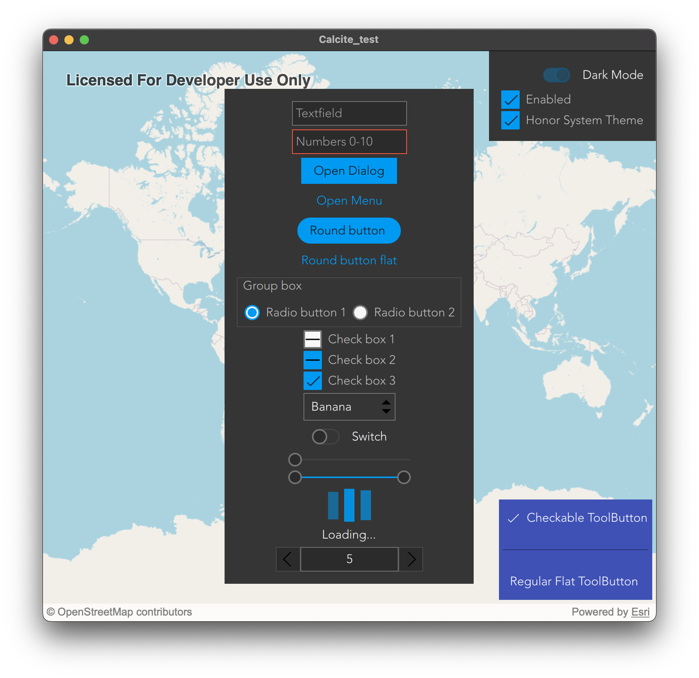

[](https://developers.arcgis.com/qt/latest/toolkit/api-reference/) [](https://developers.arcgis.com/qt/) [](https://github.com/Esri/arcgis-maps-sdk-toolkit-qt)

# Esri Calcite Style

Esri’s design system ([Calcite](https://esri.github.io/calcite-web/)) enables you to create beautiful, easy to use, and consistent experiences across apps with minimal effort.

These components are QML compatible and are configured by adding them to your .qml files. These components include options for creating Light and Dark themed UI's in you app. There are over 30 controls available like: Button, CheckBox, Menu, RadioButton, ToolBar, and so forth. This is a work-in-progress module which contains a port of Esri's Calcite Web Style that is QML compatible.

## Light Mode


## Dark Mode



## Integration

To integrate Calcite into your app, add the following lines to your `*.pro` file:

```pro
QT += quickcontrols2
RESOURCES += path/to/arcgis-maps-sdk-toolkit-qt/calcite-qml/Calcite/calcite.qrc
```

And then in `main.cpp` add the following lines:

```cpp
#include <QQuickStyle>
...
QQuickStyle::addStylePath("qrc:///esri.com/imports/");
```

Then, the most flexible way to use the style is to create a [`qtquickcontrols2.conf`](https://doc.qt.io/qt-5/qtquickcontrols2-configuration.html) file
with the following properties:

```ini
[Controls]
FallbackStyle=Material
Style=Calcite

[Calcite]
Font\Family=Avenir
Font\PixelSize=16
Font\Weight=50
```

### Typefaces

Calcite Web primarily uses Avenir Next. For best results your app should use Avenir Next, or a font similar to Avenir Next, such as Avenir or Montserrat.

#### Licensing

If you are a developer outside Esri, it is your responsibility to ensure you are complaint with
the font license agreement of any font you use.

For further details see [Calcite Web TypeFaces](https://esri.github.io/calcite-web/documentation/type/).

## Available tools

  - [x] ApplicationWindow
  - [x] BusyIndicator
  - [x] Button
  - [x] Checkbox
  - [x] CheckDelegate
  - [x] ComboBox
  - [ ] DelayButton
  - [ ] Dial
  - [x] Dialog
  - [x] DialogButtonBox
  - [x] Drawer
  - [x] Frame
  - [x] GroupBox
  - [x] ItemDelegate
  - [x] Label
  - [x] Menu
  - [x] MenuBar
  - [x] MenuBarItem
  - [x] MenuSeparator
  - [x] Page
  - [x] PageIndicator
  - [x] Pane
  - [x] Popup
  - [ ] ProgressBar
  - [x] RadioButton
  - [x] RadioDelegate
  - [x] RangeSlider
  - [x] RoundButton
  - [x] Scrollbar
  - [ ] ScrollIndicator
  - [x] Slider
  - [x] Spinbox
  - [ ] SplitHandle
  - [x] Switch
  - [ ] SwitchDelegate
  - [ ] TabBar
  - [ ] TabButton
  - [ ] TextArea
  - [x] TextField
  - [x] ToolBar
  - [x] ToolButton
  - [x] ToolSeparator
  - [ ] Tooltip
  - [ ] Tumbler

## Sample app

In the [demo](../demo) folder, there is a Qt example application project (calcite_test.pro) that showcases many of the Qt toolkit Calcite components being used.