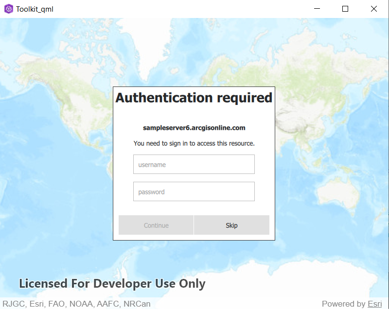
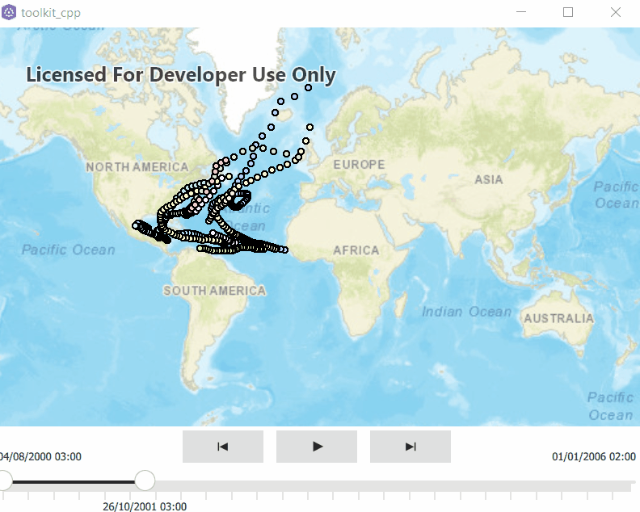

# Authentication View
AuthenticationView provides a dialog for the user to input credentials whenever an authentication challenges is produced by ArcGISRuntime. This dialog is context sensitive and will change based on the type of challenge that is produced by ArcGIS runtime.

OAuth 2.0 uses QWebEngineView. To use OAuth you must add ```QT += webenginewidgets``` to qmake in your ```.pro``` file.
td+check Qml OAuth 2.0 needs  QT += webview

### QML example code
OAuth 2.0 uses a WebView. To use an OAuthView you must call QtWebView::initialize() immediately after the QGuiApplication instance is created and must add ```QT += webview``` to qmake in your ```.pro``` file.

```c++
#include <QtWebView>
...
int main(int argc, char *argv[]){
  QGuiApplication app(argc, argv);
  QtWebView::initialize();
}
```
```c++
import Esri.ArcGISRuntime 100.12
import Esri.ArcGISRuntime.Toolkit 100.12
AuthenticationView {

    anchors.centerIn: parent

}
MapView {
    anchors.fill: parent
    
    Map {

        BasemapTopographic {}

        ArcGISMapImageLayer {

            url: "https://sampleserver6.arcgisonline.com/arcgis/rest/services/USA_secure_user1/MapServer"

        }

    }

}
```

### QWidget example code
+add code
```
```

# North Arrow
The NorthArrow tool is a UI component that always points North with reference to the orientation of your SceneView/MapView.
Double click it and will reset the map to the original orientation.


### C++ QtQuick and QML example code
```qml
import Esri.ArcGISRuntime 100.12
import Esri.ArcGISRuntime.Toolkit 100.12

MapView {
    id: view
    anchors.fill: parent

    NorthArrow {
            id: arrow
            width: 48
            height: 48
            anchors {
                right: parent.right
                top: parent.top
            }
            geoView: view
        }
        }
```

### QWidget example code
```c++
  #include "Esri/ArcGISRuntime/Toolkit/NorthArrow.h"
  ...
  auto northArrow = new Esri::ArcGISRuntime::Toolkit::NorthArrow(this);
  northArrow->setMapView(m_mapView);
  // Add your NorthArrow to your UI here!
  northArrow->show();
```

# Time Slider
The slider provides a user interface for manually setting or animating changes to the current time extent of the GeoView.
A time slider can be bound to a geoView (MapView or SceneView) to allow filtering on temporal data. The time extents of all layers in the map or scene will be used to set up the slider with the full temporal range and the current time extent.


### C++ QtQuick and QML example code
td+Qml could be different to set up. check
```qml
MapView {
        id: view
        anchors.fill: parent
        // set focus to enable keyboard navigation
        focus: true

        TimeSlider {
            anchors {
                left: parent.left
                right: parent.right
                bottom: parent.bottom
            }

            geoView: view
        }
    }
```
Add time enabled layer in the constructor of your project component (mine is Toolkit_TimeSlider_Test), for example [Hurricanes](https://sampleserver6.arcgisonline.com/arcgis/rest/services/Hurricanes/MapServer)
```c++
using namespace Esri::ArcGISRuntime;
Toolkit_TimeSlider_Test::Toolkit_TimeSlider_Test(QObject* parent /* = nullptr */) :
  QObject(parent),
  m_map(new Map(Basemap::streets(this), this))
{
  auto imgLyr = new ArcGISMapImageLayer(QUrl("https://sampleserver6.arcgisonline.com/arcgis/rest/services/Hurricanes/MapServer"), this);
  m_map->operationalLayers()->append(imgLyr);
}
```