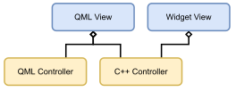

# Contributing to UI tools.

This `CONTRIBUTING.md` file covers how to specifically contribute a new UI tool to the toolkit. For general contributing
guidelines see [here](/CONTRIBUTING.md).

## Important resources

- The [Building a better toolkit](https://community.esri.com/t5/arcgis-runtime-sdks-blog/building-a-better-toolkit/ba-p/888826) Esri community blog.

- The [Qt ArcGIS Runtime API Reference](https://developers.arcgis.com/qt/api-reference/). Which includes:
  - [Qt Toolkit API](https://developers.arcgis.com/qt/toolkit/api-reference/).
  - [QML API](https://developers.arcgis.com/qt/qml/api-reference/).
  - [C++ API](https://developers.arcgis.com/qt/cpp/api-reference/).

- The [Qt ArcGIS Runtime Guide](https://developers.arcgis.com/qt/).

## UI Tools Architecture

ArcGIS Runtime for Qt provides 3 different GUI workflows.

1. **QtQuick/QML** The QML workflow is for applications written in pure QML. Used successfully in [AppStudio](https://www.esri.com/en-us/arcgis/products/arcgis-appstudio/overview). The overall philosophy of this API is that the developer should touch as little C++ code as possible. This workflow targets desktop and mobile devices.

1. **QtQuick/C++** The QtQuick/C++ workflow is for applications written in C++ with a QML QtQuick frontend. Often used by developers who care about performance/control. This workflow targets desktop and mobile devices.

1. **Widgets/C++** The Widgets/C++ workflow is for applications written in pure C++ with a Qt widget front-end. Often used by users who care about performance/control. This workflow targets desktop **only**.

Of these, `QtQuick/QML` exposed an ArcGIS Runtime QML API, incompatible with C++ ArcGIS Runtime API used in `Widgets/C++` & `QtQuick/C++`.

The challenge of writing UI tools then, is to target all these workflows with as minimum repetition as possible. The worst case scenario would be writing three separate implementations for each workflow, leading to subtle differences
and code duplication.

As such this module is split up into `Controller` and `View` components like so:

The Controller layer handles consuming an ArcGIS Runtime API and communicating with an API-agnostic View layer.

A QML View will use either a QML Controller or C++ Controller dependent on what workflow it is compiled for. A Widget View will always use the C++ Controller, thus sharing the same business logic with the Qt Quick/C++ workflow.

## Adding a new Tool

Whenever you add a new tool, remember to update the table in [README.md](README.md) naming your new tool and specify for which GUI workflow(s) it is available.

(Please also add an update to [CHANGELOG.md](/CHANGELOG.md).)

### Adding a QML QtQuick View

1. Add a new `<MyToolName>.qml` file in the [import/Esri/ArcGISRuntime/Toolkit](import/Esri/ArcGISRuntime/Toolkit) folder.
1. Register `<MyToolName>` with the associated [esri_arcgisruntime_toolkit_view.qrc](import/Esri/ArcGISRuntime/Toolkit/esri_arcgisruntime_toolkit_view.qrc) file.
1. Register `<MyToolName>` with the associated [qmldir](import/Esri/ArcGISRuntime/Toolkit/qmldir) file along with the current branch version.

### Adding a QML Controller

1. Add a new `<MyToolName>Controller.qml` file in the [import/Esri/ArcGISRuntime/Toolkit/Controller](import/Esri/ArcGISRuntime/Toolkit/Controller) folder.
1. Register `<MyToolName>Controller` with the associated [esri_arcgisruntime_toolkit_controller.qrc](import/Esri/ArcGISRuntime/Toolkit/Controller/esri_arcgisruntime_toolkit_controller.qrc) file.
1. Register `<MyToolName>Controller` with the associated [qmldir](import/Esri/ArcGISRuntime/Toolkit/Controller/qmldir) file along with the current branch version.

### Adding a C++ Controller

1. Add your `<MyToolName>Controller.h` and `<MyToolName>Controller.cpp` files to the [cpp/Esri/ArcGISRuntime/Toolkit](cpp/Esri/ArcGISRuntime/Toolkit/) folder.

1. Add  `<MyToolName>Controller.h` and `<MyToolName>Controller.cpp` to your build system by adding them to [common.pri](common.pri).

1. Register  `<MyToolName>` with the Qml ecosystem in
[register/Esri/ArcGISRuntime/Toolkit/internal/register_cpp.cpp](register/Esri/ArcGISRuntime/Toolkit/internal/register_cpp.cpp).

### Adding a C++ Widget View

1. Add your `<MyToolName>.h`, `<MyToolName>.cpp`, and `<MyToolName>.ui` files to the [widgets/Esri/ArcGISRuntime/Toolkit/](widgets/Esri/ArcGISRuntime/Toolkit/) folder.

1. Add  `<MyToolName>.h`, `<MyToolName>.cpp`, and `<MyToolName>.ui` to your build system by adding them to [toolkitwidgets.pri](toolkitwidgets.pri).

## Golden rules

What follows is general advice to be effective in writing tools.

### C++ Controller

1. Don't refer to `MapQuickView`/`MapGraphicsView` directly. Use [MapViewToolkit](cpp/Esri/ArcGISRuntime/Toolkit/Internal/GeoViews.h).

   `MapQuickView` is a `MapView` that integrates into QtQuick, `MapGraphicsView` is a `MapView`that integrates into `MapGraphicsView`. In the Controller layer we need to be agnostic, which `MapViewToolkit` enables by being an alias
   to the appropriate `MapView` dependent on what workflow we are being compiled for.

   The same is true for `SceneQuickView`/`SceneGraphicsView`!

2. Make use of the [Adaptor](https://refactoring.guru/design-patterns/adapter) pattern.

   Exposing an ArcGIS Runtime class to to QML can be tricky because the C++ types don't expose properties for
   free. The best way around this is to wrap an ArcGIS Runtime type in an adaptor, which exposes the required
   properties in a QML friendly-way. For example, [FloorFilterSiteItem](cpp/Esri//ArcGISRuntime/Toolkit/FloorFilterSiteItem.h),
   wraps and exposes the properties of [FloorSite](https://developers.arcgis.com/qt/cpp/api-reference/esri-arcgisruntime-floorsite.html).

   Widget views may also benefit from the adaptor pattern, as the adaptor has full control over data formatting 
   and update behavior.

3. Re-expose collections in a [GenericListModel](cpp/Esri/ArcGISRuntime/Toolkit/Internal/GenericListModel.h).

   This goes hand-in-hand with the "use an adaptor" step. How do you expose a collection of `ArcGISRuntime` types in a QML-friendly way? `GenericListModel` reduces the boilerplate in this area by scanning the QObject metadata of 
   a given class, exposing each public property as a data role. 
  
   (For example, if the `GenericListModel` is instantiated with a particular class `Foo`, which has 2 properties, `GenericListModel` will expose 2 roles with the same name as those properties in `Foo`.)

4. Accept/expose `GeoView` as a `QObject` in your public interface. 

   (Example: [NorthArrowController::setGeoView](cpp/Esri//ArcGISRuntime/Toolkit/NorthArrowController.h)).

   This may seem counter-intuitive, but will save you headaches down the line.

   At the time of writing `GeoView` does not inherit from `QObject`, meaning you can not `qobject_cast` a
   `GeoView` into a `SceneViewToolkit` or a `MapViewToolkit`. 

   Never attempt a `dynamic_cast`! `dynamic_cast` is not supported across library boundaries and we have hit
   issues in the past. `qobject_cast` is the only way to safely execute a dynamic upcast. Thus, you must accept
   a `QObject` type or some type that derives from `QObject` in this interface if you plan to upcast.

### QML Controller

1. Make use of an `internal` `QtObject` to hide implementation details. This doesn't prevent the developer from accessing these properties, but it helps hide them from the autocomplete.

### QML View

1. Inherit from `Control` or derivatives.

   (Unless you have a good reason not to do so.)

   When writing a new tool, favour subclassing `Control` or one of `Control`'s subclasses. This will mean 
   your tool participates in font/palette inheritance, and the content/background will be easily configurable 
   by the consuming developer.
  
   Do not inherit from `Item` unless you have a specific use-case in mind.

2. Compose using `Control` derivatives.

   When composing your tool, choose `Control`-friendly types over other QML primitives.

   Examples: 
   
   - If you want a background, do not use [Rectangle](https://doc.qt.io/qt-5/qml-qtquick-rectangle.html), 
   use [Pane](https://doc.qt.io/qt-5/qml-qtquick-controls2-pane.html). 

   - If you want to render some text, do not use [Label](https://doc.qt.io/qt-5/qml-qtquick-controls2-label.html) use
   [Text](https://doc.qt.io/qt-5/qml-qtquick-text.html). 

   - Use `ItemDelegate`/`SwitchDelegate`/`RadioDelegate` etc in `ListView`s. Avoid creating custom delegate implementations
     that are built around `Item`. Avoid using inappropriate delegates like `Button` or `CheckBox` when an `ItemDelegate` 
     or `CheckDelegate` would be more appropriate.
   
   There are a [rich variety](https://doc.qt.io/qt-5/qtquick-controls2-qmlmodule.html) of `Control`s that can serve 
   as composable primitives in your new tool. It is worth your time to familiarize yourself with them.

   Any QML component you use which is not a `Control` will not participate in the styling, palette, or font system, and  may exhibit less advanced margin/padding behavior. Types like `Rectangle` are best saved for when you 
   need to render an actual rectangle, such as the striping in the Scalebar tool.

3. Understand when to use `anchors`, `Grid`, `GridLayout` and absolute positioning.

   There is a myriad of ways to layout items in QML. Some are more appropriate than 
   others in certain situations.

   - Use [GridLayout](https://doc.qt.io/qt-5/qml-qtquick-layouts-gridlayout.html) (along with `ColumnLayout` and `RowLayout`) when
     you care about the **placement** and **sizing** of multiple items.

   - Use [Grid](https://doc.qt.io/qt-5/qml-qtquick-grid.html) (along with `Column` and `Row`) when you care about
     the **placement** of multiple items, but do not wish to influence the sizing of the items (rarely needed if ever.)

   - Use [anchors](https://doc.qt.io/qt-5/qtquick-positioning-anchors.html) when the other options seem inappropriate, 
     either because you are sizing one item, or you need to size/position items relative to the parent, independent 
     of siblings.

   - Set the `x`, `y`, `width` and `height` options as sparingly as possible, as this ignores padding, margins, 
     and content bounds. Usually only required when defining new primitives, like the speech-bubble in 
     the `Callout` tool.

### Widget View

1. Prefer usage of UI files for composition and declaration where possible.

2. Always have a constructor of the form `MyTool(QWidget* parent = nullptr)`.
   This is the only constructor that the Qt forms editor can handle. 

   If you are wondering "How do I set a value at construction which can't be changed?"
   Note that this doesn't fit into the Qt's API design philosophy. It's best to expose getters and setters
   which can be mutated at any point during a Widget's lifetime.
