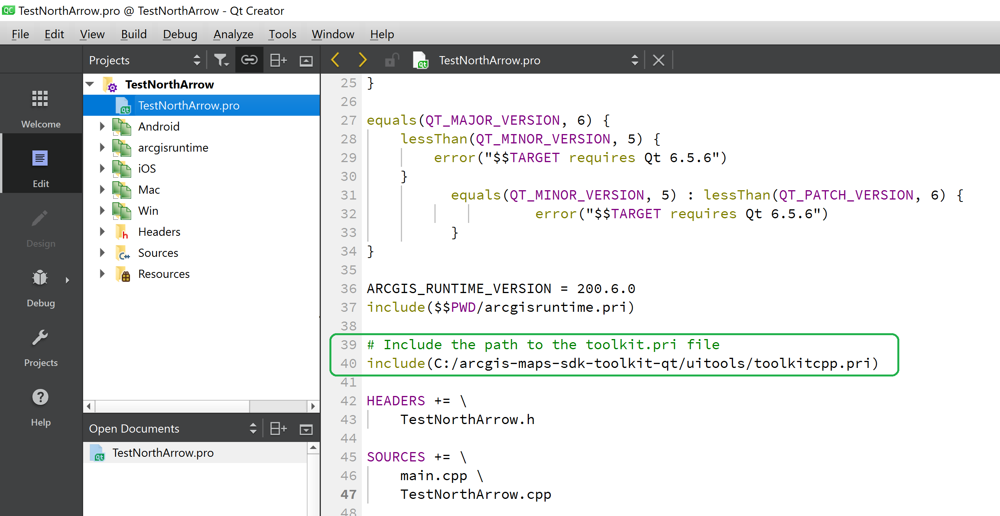

[](https://developers.arcgis.com/qt/latest/toolkit/api-reference/) [](https://developers.arcgis.com/qt/) [](https://github.com/Esri/arcgis-maps-sdk-toolkit-qt)

## ArcGIS Maps SDK - Qt Quick UI components

These are controls that compliment your `MapView` or `SceneView` by adding them to your Qt project's .qml files (QML based UI development). They are components like: AuthenticationView, NorthArrow, OverviewMap, TimeSlider, and so forth. Using these components are very beneficial for device based apps like phones and tablets.

You can learn more about the benefits of building apps with the [Qt Quick UI controls](https://doc.qt.io/qt-6/qtquickcontrols-index.html) from the Qt Group. 

## Available components

These are the components available to use:

- **[AuthenticationView - Qt Quick UI control/QML Type](docs/AuthenticationView.md)** - A wrapper view that will automatically display the proper authentication view for any of the supported authentication types (OAuth, Token, HTTP Basic, HTTP Digest, SAML, PKI).
- **[BasemapGallery - Qt Quick UI control/QML Type](docs/BasemapGallery.md)** - Shows a list of available basemaps by using a Portal or using a user defined collection. User is able to select a basemap, setting it on the current Geomodel.
- **[BookmarksView - Qt Quick UI control/QML Type](/docs/BookmarksView.md)**- A control that displays and navigates to bookmarks that have been authored in a map.
- **[Callout - Qt Quick UI control/QML Type](docs/Callout.md)** - A view for displaying information at a geographic location.
- **[CoordinateConversion - Qt Quick control/QML Type](docs/CoordinateConversion.md)** - A tool that helps convert coordinates from one coordinate system to another.
- **Floor filter** - A tool that shows sites and facilities, and enables toggling the visibility of levels on floor-aware maps and scenes.
- **[NorthArrow - Qt Quick UI control/QML Type](docs/NorthArrow.md)** - A control that indicates north, reacting to rotation changes of the map.
- **[OverviewMap - Qt Quick UI control/QML Type](docs/OverviewMap.md)** - An inset map that shows the current extent of an associated GeoView in the context of a larger area.
- **[PopupStackView - Qt Quick UI control/QML Type](docs/PopupStackView.md)** - A view based on the Popup view that can show multiple Popups as flickable pages.
- **[PopupView - Qt Quick UI control/QML Type](docs/PopupView.md)** - A view that displays feature attributes and attachments.
- **[Scalebar - Qt Quick UI control/QML Type](docs/Scalebar.md)** - A tool that indicates the proportions of a map to the actual geographic area so users can visually gauge distances on a map view.
- **[SearchView - Qt Quick UI control/QML Type](docs/SearchView.md)** - A tool that submits search queries and shows single or multiple results. Queries can be restricted to the current view extent.
- **[TimeSlider - Qt Quick UI control/QML Type](docs/TimeSlider.md)** - A control for changing the current time extent on a view using a slider that moves between the defined minimum and maximum time values.
- **[UtilityNetworkTrace - Qt Quick UI control/QML Type](docs/UtilityNetworkTrace.md)**- A control that streamlines utility network trace workflows by allowing the user to select a starting point and trace configuration.

## Options to use the components in your project

There are two options to make use of the Qt Quick UI components depending on how your app development configuration:

### OPTION1: Making use of the toolkitcpp.pri file

#### Importing the toolkit (toolkitcpp.pri)

A good way to start using the toolkit is to use one of the template apps which get added to QtCreator when you install the ArcGIS Runtime SDK for Qt.

- In Qt Creator choose "File > New project" from the menus. 

- In the "New Project - Qt Creator" dialog. Select "ArcGIS" in the Project template on the left and then choose the "ArcGIS Maps 200.6.0 Qt Quick C++ App" template. Then click teh "Choose..." button.

- Complete the rest of the dialog wizard options to create a project. For example:
 -- Project Location ==> Name TestNorthArrow, Create in: "C:\temp"
 -- Define Build System ==> Build System: qMake
 -- Define Project Details ==> App Description: Test using a NorthArrow, 3D project: unchecked, ArcGIS OnlineBasemap: Imagery, AccessToken: [see:https://developers.arcgis.com/documentation/security-and-authentication/api-key-authentication/tutorials/create-an-api-key/]
 -- Kit Selection ==> Desktop Qt 6.5.6 MSVC2019 64bit
 -- Project Management ==> Add asa subproject to project: none, Add to version control: none

- In your apps `.pro` file, add an `include` statement that points to the path of the `toolkit.pri` file that you have on disk. For example:

```qmake
include(C:/arcgis-maps-sdk-toolkit-qt/uitools/toolkitcpp.pri)
```



- In `main.cpp` add a line to import the toolkit registration function:

```cpp
#include "Esri/ArcGISRuntime/Toolkit/register.h"
```

- In `main.cpp` (inside the main function) call the registration function:

```cpp
QQmlApplicationEngine engine; // The engine driving your QML application.
Esri::ArcGISRuntime::Toolkit::registerComponents(engine);
```

#### Using a tool from the toolkit (toolkitcpp.pri)

Once you have successfully imported the toolkit, you can access individual tools in your own QML files.

- Add an import statement for the toolkit:
`import Esri.ArcGISRuntime.Toolkit`

- Declare the tool you wish to use. Generally you will also have to supply the `GeoView` etc. you wish the tool to work with. 

For example, to add a `NorthArrow`:

```qml
import Esri.ArcGISRuntime.Toolkit

MapView {
    id: mapView

    // A visible compass is now embedded in the mapView and hooked up!
    NorthArrow {
        id: arrow
        width: 32
        height: 32
        anchors {
            right: parent.right
            bottom: parent.bottom
        }
        geoView: mapView
    }
}
```

### OPTION2: CMake based projects 

#### Importing the toolkit (toolkitcpp.cmake)

A good way to start using the toolkit is to use one of the template apps which get added to QtCreator when you install the ArcGIS Runtime SDK for Qt.

- In QtCreator choose `File/New file or project/ArcGIS/ArcGIS Maps 200.4.0 Qt Quick C++ App`
- Choose settings to match the platform etc. you are building for
- Copy the `toolkitcpp` subdirectory into your project's directory
```bash
cp -r /path/to/toolkit/uitools/toolkitcpp /path/to/project
```
- The following code block is pregenerated in the `CMakeLists.txt` of your template app, uncomment the `add_subdirectory` and `target_link_libraries` commands:
  ```CMake
    # To integrate the toolkit, copy the `toolkitcpp` subdirectory from the toolkit
    # into your project's directory. Then uncomment the following lines to add it to your project.
    # See https://github.com/Esri/arcgis-maps-sdk-toolkit-qt for details
    # add_subdirectory(toolkitcpp)
    # target_link_libraries(${PROJECT_NAME} PRIVATE libtoolkitcpp)
  ```
- In the `main.cpp` file of your new application, do the following:
  - Include the `register.h` file from the toolkit
  ```cpp
  #include "Esri/ArcGISRuntime/Toolkit/register.h"
  ```
  - Call the `registerComponents` function with your `QQmlApplicationEngine`
  ```cpp
  QQmlApplicationEngine engine; // The engine driving your QML application.
  Esri::ArcGISRuntime::Toolkit::registerComponents(engine);
  ```
#### Using a tool from the toolkit (toolkitcpp.cmake)

Once you have successfully imported the toolkit, you can access individual tools in your own QML files.

- Add an import statement for the toolkit:
`import Esri.ArcGISRuntime.Toolkit`

- Declare the tool you wish to use. Generally you will also have to supply the
  `GeoView` to the tool you want to work with. For example, to add a `NorthArrow`:

```qml
import Esri.ArcGISRuntime.Toolkit

MapView {
    id: mapView

    // A visible compass is now embedded in the mapView and hooked up!
    NorthArrow {
        id: arrow
        width: 32
        height: 32
        anchors {
            right: parent.right
            bottom: parent.bottom
        }
        geoView: mapView
    }
}
```

## Access token requirements

Some of the toolkit components and examples utilize ArcGIS location services which require an access token. Please see the [setup guide](http://links.esri.com/create-an-api-key) for more information.

## Sample app

In the [examples](../examples) folder, there is a Qt example application project (UitoolExamples.pro) that showcases many of the Qt toolkit components used in a C++ app based on the Qt Quick UI controls.