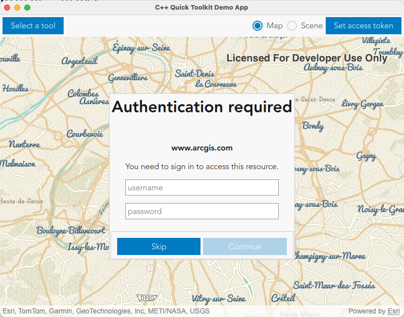

[](https://developers.arcgis.com/qt/) [](https://github.com/Esri/arcgis-maps-sdk-toolkit-qt) [](../../toolkitcpp/)

# Authenticator - Qt Quick UI/QML Type

The [Authenticator- Qt Quick UI/QML Type](https://developers.arcgis.com/qt/toolkit/api-reference/qml-esri-arcgisruntime-toolkit-authenticator.html) handles authentication challenges and automatically launches the appropriate UI for each type of authentication. The following security formats are supported.

- ArcGIS Token 
- HTTP Basic 
- HTTP Digest 
- ArcGIS OAuth
- SAML
- IWA (Kerberos & NTLM)
- PKI



## How to use

To get started, declare an Authenticator in your QML file. 

```qml
Authenticator {
    anchors.centerIn: parent
}
```

A full tutorial for setting up the Authenticator is available in the [developer guide](https://developers.arcgis.com/qt/security-and-authentication/tutorials/access-services-with-oauth-2-0/)

## ArcGIS Authentication
Portals configured to use ArcGIS Authentication will use token authentication by default. To use OAuth, you must pass in an instance of `OAuthUserConfiguration` with the Portal URL, client ID, and redirect URL to the `OAuthUserConfigurationManager`.

```cpp
DemoApp::DemoApp(QObject* parent /* = nullptr */):
  QObject(parent),
  m_map(new Map(new PortalItem(s_itemId, new Portal(true /*loginRequired*/, this)), this))
{
    const auto redirectUrl = QString{"qt-maps-sdk-app:/oauth2/callback"};
    auto* config = new OAuthUserConfiguration(QUrl{"https://www.arcgis.com/"}, s_clientId, redirectUrl, this);
    OAuthUserConfigurationManager::instance()->addOAuthUserConfiguration(config); 
}
```

When using OAuth, there are two different login experiences available: 1) an external out-of-process browser, and 2) an in-app embedded browser. Full details on these two options are found in the API Reference documentation for [OAuthUserConfiguration](https://developers.arcgis.com/qt/cpp/api-reference/esri-arcgisruntime-authentication-oauthuserconfiguration.html). The Authenticator will respond to however the `OAuthUserConfiguration` is setup without any further modification, provided all the requirements are fulfilled.

NOTE: OAuth 2.0 uses a WebView when using the in-app embedded browser workflow. To use an OAuthView you must call `QtWebView::initialize()` before the QGuiApplication instance is created. See [Qt WebView](https://doc.qt.io/qt-6/qtwebview-index.html).

## Network Authentication

Portals configured to use network security (such as IWA and PKI) will automatically be detected with no additional configuration needed.

When connecting to IWA secured services using Kerberos, Windows clients will automatically use your domain's credentials to sign in, meaning no UI requesting credentials will be displayed. All other operating systems will launch a UI view prompting for a username and password.