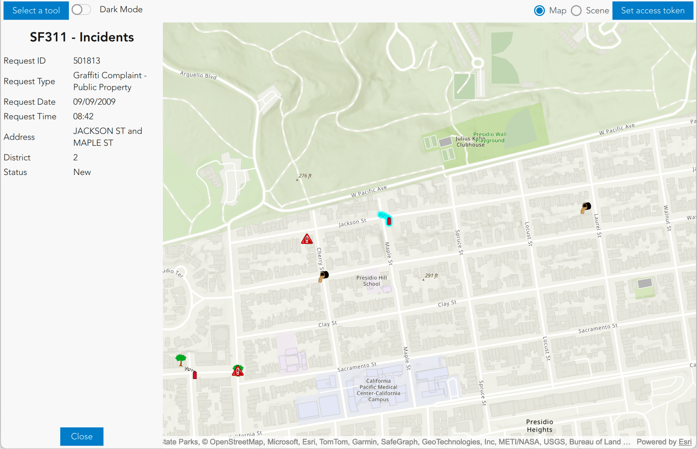

  

# PopupStackView - Qt Quick UI control/QML Type

The [PopupStackView - Qt Quick UI control/QML Type](https://developers.arcgis.com/qt/toolkit/api-reference/qml-popupstackview.html) control provides a view for displaying and editing information of GeoElements, including Features and Graphics. A PopupStackView can be used to display information for any type that implements the PopupSource interface. For example, FeatureLayer implements PopupSource. This means that it has a PopupDefinition, which defines how the Popup should look for any features in that layer.

An example workflow for displaying a PopupStackView for features in a FeatureLayer would be:

- Declare a PopupStackView and anchor it to a desired location.
- Perform an identify operation on a GeoView and select the desired Features from the identify result.
- Create Popups from the Features.
- Optionally obtain the Popup's PopupDefinition and set the title, whether to show attachments, and so on.
- Create a PopupManager from the Popup and add it to a list of PopupManagers
- Assign the list mentioned in the above step to the PopupStackView's popupManagers property

The PopupStackView is a QML Item that can be anchored, given to a dialog, or positioned using XY screen coordinates. Transform, Transition, and other QML animation types can be used to animate the showing and dismissing of the view.

For more information, please see the Popup and PopupManager documentation.

NOTE: Each time a change is made to the Popup, PopupDefinition, PopupManager, or any of their properties, the popupManagers must be re-set to the PopupStackView.

