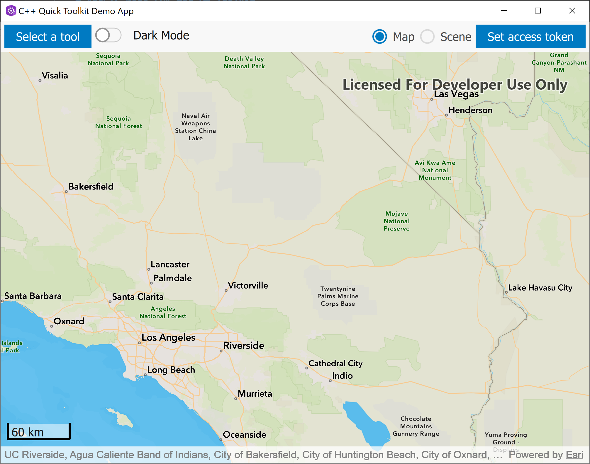

  

# Scalebar - Qt Quick UI control/QML Type

A [Scalebar - Qt Quick UI control/QML Type](https://developers.arcgis.com/qt/toolkit/api-reference/qml-scalebar.html) control that shows an accurate distance that can be used to visually gauge distances on a map view. The measurement system used is controlled by unitSystem. The units used will be appropriate to the distance being shown e.g. `km` for long distances and `m` for shorter distances.

