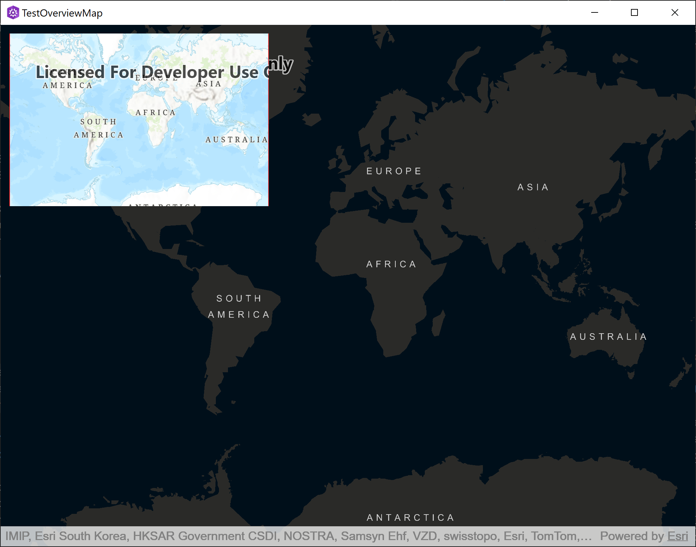

[](https://developers.arcgis.com/qt/latest/toolkit/api-reference/) [](https://developers.arcgis.com/qt/) [](https://github.com/Esri/arcgis-maps-sdk-toolkit-qt)

## ArcGIS Maps SDK - Qt Widgets UI components

These are controls that compliment your `MapView` or `SceneView` by adding them to your projects .cpp files. They are components like: AuthenticationView, NorthArrow, OverviewMap, TimeSlider, and so forth. Using these components are very beneficial for traditional desktop based apps.

You can learn more about the benefits of building apps with the [Qt Widgets UI controls](https://doc.qt.io/qt-6/qtwidgets-index.html). 

## Available components

These are the **Qt Widgets UI control/Class** available to use:

- **[AuthenticationView](docs/AuthenticationView.md)** - A wrapper view that will automatically display the proper authentication view for any of the supported authentication types (OAuth, Token, HTTP Basic, HTTP Digest, SAML, PKI).
- **[BasemapGallery](docs/BasemapGallery.md)** - Shows a list of available basemaps by using a Portal or using a user defined collection. User is able to select a basemap, setting it on the current Geomodel.
- **[BookmarksView](/docs/BookmarksView.md)**- A control that displays and navigates to bookmarks that have been authored in a map.
- **[CoordinateConversion](docs/CoordinateConversion.md)** - A tool that helps convert coordinates from one coordinate system to another.
- **[FloorFilter](docs/FloorFilter.md)** - A tool that shows sites and facilities, and enables toggling the visibility of levels on floor-aware maps and scenes.
- **[NorthArrow](docs/NorthArrow.md)** - A control that indicates north, reacting to rotation changes of the map.
- **[OverviewMap](docs/OverviewMap.md)** - An inset map that shows the current extent of an associated GeoView in the context of a larger area.

NOTE: Due to the open source nature of the Qt toolkit repo, you may notice that currently there are not as many Qt Widget UI components as there are Qt Quick UI versions. You are welcome to create you own components to suit your needs. The [Qt Toolkit API Reference](https://developers.arcgis.com/qt/toolkit/api-reference/) should be your starting point (in particular expand the "C++ Classes" section in the TOC) to learn about developing custom UI components. The API classes have been architected to utilize MVC design principals, so for each view, there is an associated controller (the word "Controller" is appended to the class name).

## Options to use the components in your project

There are two options to make use of the Qt Widgets UI components depending on your Qt Creator app development build configuration (qmake or CMake):

### OPTION 1: Qt Creator projects built using qmake (making use of the toolkitcpp.pri file)

A good way to start using the toolkit is to use one of the ArcGIS Maps SDK for Qt templates to build an app. The following steps show an example of adding the NorthArrow control.

- In Qt Creator choose **File** > **New project** from the menus. 

- In the **New Project - Qt Creator** dialog. Select **ArcGIS** in the Project template on the left and then choose the **ArcGIS Maps 200.x.0 Qt Widgets app** template. Then click the **Choose...** button.

- Now complete the rest of the dialog wizard options to create a project.

> For example:
>
>  **Project Location** ==> **Name:** TestNorthArrow, **Create in:** C:\temp
>
>  **Define Build System** ==> **Build System:** qmake
>
>  **Define Project Details** ==> **App Description:** Test using a NorthArrow, **3D project:** leave unchecked, **ArcGIS OnlineBasemap:** Imagery, **AccessToken:** see: [Create an API Key](https://developers.arcgis.com/documentation/security-and-authentication/api-key-authentication/tutorials/create-an-api-key/)
>
>  **Kit Selection** ==> Desktop Qt 6.5.6 MSVC2019 64bit (or higher)
>
>  **Project Management** ==> **Add as a subproject to project:** none, **Add to version control:** none

- In your apps `.pro` file (for example: TestNorthArrow.pro), add an `include` statement that points to the path of the `toolkit.pri` file that you have on disk. 

> For example:
> ```cpp
> ...
> include($$PWD/arcgisruntime.pri)
>
> # Include the path to the toolkit.pri file
> include(C:/arcgis-maps-sdk-toolkit-qt/toolkit/uitools/toolkitcpp.pri)
> ...
> ```  

- In the `main.cpp` file, add an `include` statement near the top of the file to import the toolkit `registration.h` file and then later in file call the `ToolkitregisterComponents()` function.

> For example:
> ```cpp
> ...
> #include <QQmlApplicationEngine>
>
> // Needed for the Qt toolkit
> #include "Esri/ArcGISRuntime/Toolkit/register.h"
> ...
>
> ...
> // Intitialize application view
> QQmlApplicationEngine engine;
>
> // Register the toolkit
> Esri::ArcGISRuntime::Toolkit::registerComponents(engine);
> ...
> ``` 

Once you have successfully imported the toolkit, you can create individual tools in your own widgets files.

- In your widgets code, create a new instance of the tool you wish to use and add it to your widgets layout. You will also normally need to pass the `GeoView` which the tool is designed to work with:

> ```cpp
>  #include "Esri/ArcGISRuntime/Toolkit/NorthArrow.h"
>  ...
>
>  auto northArrow = new Esri::ArcGISRuntime::Toolkit::NorthArrow(this);
>  northArrow->setMapView(m_mapView);
>  // Add your NorthArrow to your UI here!
>  northArrow->show();
> ```

When you run your app, you should now see the UI for the Qt toolkit component in your app. For example:


### OPTION 2: Qt Creator projects built using CMake based projects (making use of the CMmakeLists.txt file)

A good way to start using the toolkit is to use one of the ArcGIS Maps SDK for Qt templates to build an app. The following steps show an example of adding the OverviewMap control.

- In Qt Creator choose **File** > **New project** from the menus. 

- In the **New Project - Qt Creator** dialog. Select **ArcGIS** in the Project template on the left and then choose the **ArcGIS Maps 200.x.0 Qt Widgets app** template. Then click the **Choose...** button.

- Now complete the rest of the dialog wizard options to create a project.

> For example:
>
>  **Project Location** ==> **Name:** TestOverviewMap, **Create in:** C:\temp
>
>  **Define Build System** ==> **Build System:** CMake
>
>  **Define Project Details** ==> **App Description:** Test using an OverviewMap, **3D project:** leave unchecked, **ArcGIS OnlineBasemap:** Streets Night, **AccessToken:** see: [Create an API Key](https://developers.arcgis.com/documentation/security-and-authentication/api-key-authentication/tutorials/create-an-api-key/)
>
>  **Kit Selection** ==> Desktop Qt 6.5.6 MSVC2019 64bit (or higher)
>
>  **Project Management** ==> **Add as a subproject to project:** none, **Add to version control:** none

- Copy the `toolkitcpp` subdirectory into your project's directory. For example you could modify this `bash` script to do the copy of the toolkit directories/files for you:
> ```bash
> cp -r /path/to/toolkit/uitools/toolkitcpp /path/to/project
> ```

- Edit the `CMakeLists.txt` in your Qt project (it was created when you went through the ArcGIS Maps SDK for Qt template wizards). Uncomment the `add_subdirectory` and `target_link_libraries` commands:

> ```CMake
> ...
> # To integrate the toolkit, copy the `toolkitcpp` subdirectory from the toolkit
> # into your project's directory. Then uncomment the following lines to add it to your project.
> # See https://github.com/Esri/arcgis-maps-sdk-toolkit-qt for details
> add_subdirectory(toolkitcpp)
> target_link_libraries(${PROJECT_NAME} PRIVATE libtoolkitcpp)
> ...
> ```

Once you have successfully imported the toolkit, you can create individual tools in your own widgets files.

- In your widgets code, create a new instance of the tool you wish to use and add it to your widgets layout. You will also normally need to pass the `GeoView` which the tool is designed to work with:

> ```cpp
> #include "Esri/ArcGISRuntime/Toolkit/OverviewMap.h"
> ...
> auto overviewMap = new Esri::ArcGISRuntime::Toolkit::OverviewMap(this);
> overviewMap->setMapView(m_mapView);
>
> // Add your OverviewMap to your UI here!
> northArrow->show();
> ```

When you run your app, you should now see the UI for the Qt toolkit component in your app. For example:


## Access token requirements

Some of the toolkit components and examples utilize ArcGIS location services which require an access token. Please see the [setup guide](http://links.esri.com/create-an-api-key) for more information.

## Sample app

In the [examples](../examples) folder, there is a Qt example application project (UitoolExamples.pro) that showcases many of the Qt toolkit components used in a C++ app based Qt Quick UI controls. Currently, there is not an example application that demonstrates Qt toolkit components used in a C++ app based on the Qt Widget UI controls.